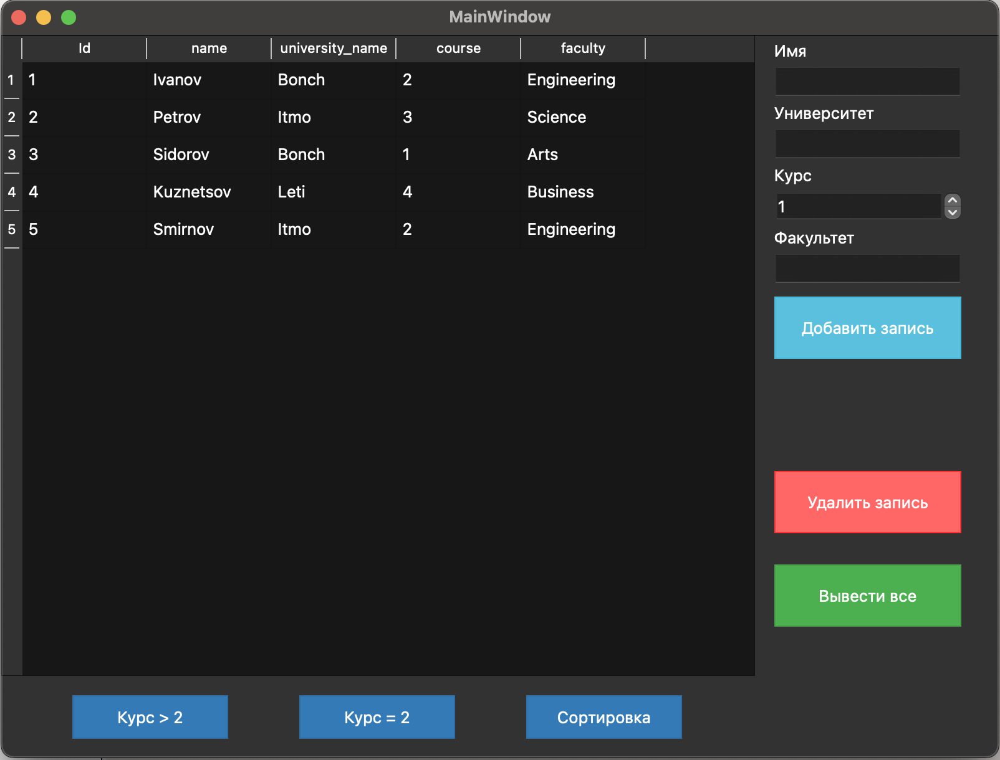

# Qt Database Application

📚 Простое настольное приложение на **Qt** для работы с базой данных **SQLite**.  
Позволяет просматривать, добавлять, фильтровать, сортировать и удалять данные студентов.

## 🖼 Интерфейс

Приложение содержит графический интерфейс с использованием Qt Designer и следующих элементов:

- `QTableView` — отображение таблицы студентов
- `QLineEdit` — поля ввода имени, университета и факультета
- `QSpinBox` — ввод курса
- `QPushButton` — кнопки для операций (добавить, удалить, фильтровать, показать все, сортировать)

## 🧠 Функциональность

- Создание таблицы `students` при первом запуске
- Автозаполнение тестовыми данными
- Добавление новых студентов
- Удаление студентов по ID
- Сортировка по имени
- Фильтрация:
  - Курс равен 2
  - Курс больше 2
- Сброс фильтра и отображение всех данных

## 🛠 Технологии

- C++ / Qt 5+
- QtWidgets
- Qt SQL (QSqlDatabase, QSqlQuery, QSqlTableModel)
- SQLite

## 📦 Установка и запуск

1. Убедитесь, что установлен Qt и Qt Creator.
2. Склонируйте репозиторий или скачайте архив:
3. Запустите сборку

## 🪪 Лицензия

Проект распространяется под лицензией MIT.
